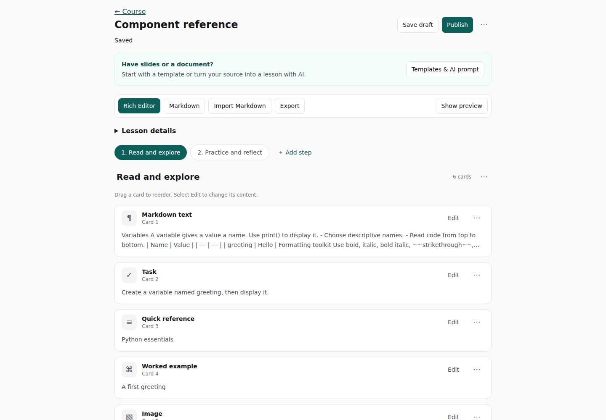

# TeachCode Content Studio

A standalone course authoring app for turning teaching materials into interactive lessons. Author with compact cards or Markdown, bring slides and documents through your AI app, and preview the learner experience before publishing.



**SQLite is an isolated local demo**, never the shared TeachCode database. PostgreSQL is the shared deployment target. Publishing updates this Studio’s public learner route and published-content API immediately. Integration with the legacy TeachCode student app is a separate follow-up. YAML migration is out of scope.

## Local setup

Requires Node.js 22.13 or newer (Node 22 is used in CI).

```sh
npm install
cp .env.example .env.local
npm run db:init:sqlite
npm run dev
```

Open http://localhost:3000/login. Local-only accounts all use `password`:

| Account             | Access                                           |
| ------------------- | ------------------------------------------------ |
| admin@hku.hk        | All courses, structure, assignments, publication |
| python.staff@hku.hk | Python course drafts                             |
| r.staff@hku.hk      | R course drafts                                  |

Never provision these credentials in a shared environment. Seeding is restricted to SQLite. Initialization is repeatable and does not overwrite migrated lesson data. A pre-migration scaffold database is preserved as a `.legacy-*.bak` file before a new database is initialized.

## Authoring

Courses use one nested **Lessons & chapters** outline: each lesson contains its chapters. Drag a lesson card to reorder the whole lesson, or drag a chapter within its lesson or into another lesson. **Add lesson** and **Add chapter** sit below the outline; chapter creation lets you choose its lesson. **Edit lesson** reveals the title and empty-lesson deletion controls. Click a chapter title to edit its content. Keyboard users can focus a card, press Space, use arrow keys, then press Space to drop (Escape cancels). Assigned staff see the same hierarchy; admins manage its structure.

The existing database/API names (`modules` for lesson groups, `lessons` for chapters) and Markdown `:::lesson` syntax remain compatible with saved content and links.

Editor links use readable slugs, for example `/courses/python-foundations/lessons/component-reference/edit` (or `/preview`). Old UUID links redirect to the current readable URL. Saving a lesson slug updates the address bar after the save succeeds; changing a course slug redirects to its new address. Title changes alone leave URLs intact. Old slug bookmarks need updating after a slug rename; UUID bookmarks remain stable. APIs continue using internal IDs.

Open a course and chapter, or create one as admin. Edit metadata, steps and typed cards in Rich Editor. Use **Import Markdown** or paste into the Markdown tab. Invalid source stays visible and is saved alongside the last valid model; publication is blocked until it is fixed. Rich Editor shows one step at a time with compact cards. Click **Edit** to open a card, drag its surface to reorder, or use the card menu’s keyboard-accessible move actions. Add a **Markdown text** card for formatted prose; other cards use focused fields. Preview is optional. Raw HTML is not rendered.

Use [component-reference.md](content/component-reference.md) as your **Markdown syntax reference**, then write and import your own Python lessons. This sample is not the original Python Launchpad source. The local seed contains a reference lesson demonstrating all eleven components.

### Slides or document → AI → chapter

1. Open a chapter and select **Templates & AI prompt**.
2. Select **Copy prompt**. Paste it into your AI app, then paste your document at the source marker or attach your slides/document. The copied prompt includes the dialect rules and complete syntax example.
3. Copy the generated lesson into Studio’s **Markdown** tab, or save it as `.md` and choose **Import Markdown**. Start with a new chapter if you want to preserve existing content: import replaces the current chapter and autosaves it.
4. Review any validation messages, check generated facts and answers, edit in **Rich Editor**, and open **Show preview** (or **Preview** on mobile). Publish when ready.

The same toolkit offers **Complete Markdown template**, with copy and download controls. It covers all eleven card types, nested fields, headings, emphasis, links, lists, checklists, quotes, tables, code, and other supported formatting. Raw HTML, math rendering, and Mermaid are not enabled. The [prompt brief](content/ai-authoring-prompt.md) is maintained alongside the [dialect guide](docs/markdown.md); the UI combines both with the template into one copyable prompt. No AI account or API key is needed in Studio.

Draft changes autosave after a one-second debounce. Explicit Save Draft is also available. Version checks reject stale writers. Publishing creates a separate immutable revision and marks the course published. Later draft edits, including slug changes, leave the published snapshot and its URL intact. Unpublishing a course hides its lessons; archiving or unpublishing a chapter removes public access.

## Verification

```sh
npm run lint
npm run typecheck
npm test
TEST_POSTGRES=1 npm test
npm run build
npx playwright install chromium
npm run test:e2e
TEST_RUNTIMES=1 npm run test:e2e
```

SQLite and browser tests use disposable databases. `TEST_POSTGRES=1` starts a disposable real PostgreSQL cluster with fixture identity tables; it does not connect to the shared database. Runtime smoke tests are opt-in because they download Python/R browser runtimes from public CDNs. CI runs lint, typecheck, unit/database tests, build and browser/API smoke tests.

## Guides

- [Database setup, migrations and rollback](docs/database.md)
- [Markdown dialect and nested fields](docs/markdown.md)
- [API and authentication](docs/api.md)
- [Architecture and schema](docs/architecture.md)
- [Execution security and deployment follow-ups](docs/security.md)

The implemented demo includes normalized storage, editor forms, Markdown round trips, autosave, immutable publication, permissions, assignment search, course/module management, ordering, shared learner rendering, and browser worker execution. The deployment-specific and runtime limitations are documented separately; this is not a claim that the shared TeachCode production environment has been verified.
