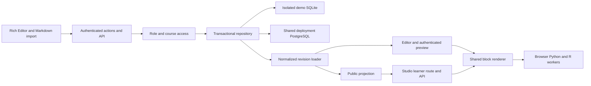
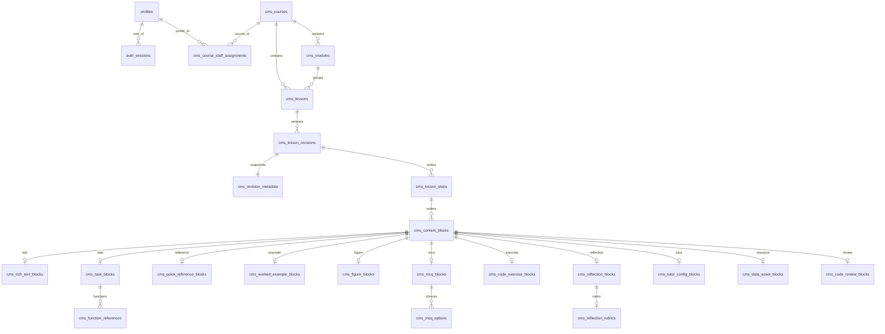

# Architecture

`lib/content.ts` is the shared typed schema. `lib/markdown.ts` implements strict directive parsing and serialization. `lib/repository.ts` writes and hydrates normalized component detail rows and creates immutable publication snapshots. `lib/cms.ts` and `lib/management.ts` authorize course access and structure mutations. `lib/auth.ts` is the replaceable shared identity adapter. `lib/db.ts` selects the database implementation and owns transactions.

Every PostgreSQL transaction holds one pool client until commit/rollback. SQLite serializes operations per connection and uses database write locks. Versioned saves lock the lesson row and compare the expected version. Publication saves the draft and copies metadata, steps, blocks and nested detail rows within that same transaction; subsequent draft changes cannot mutate the published revision. Stable component/choice IDs are distinct from physical revision row IDs.

# Relational schema

Each content block has exactly one matching typed detail record in repository writes; loaders report corruption rather than dropping incomplete blocks. Nested function references, options and rubrics use their own tables. JSON is limited to extensible style/randomisation settings and scalar lists in SQLite/text metadata; there is no generic lesson/block JSON payload column. Revision metadata is column-oriented, with source Markdown retained separately for editing. A local `cms_schema_migrations` table and an equivalent PostgreSQL table record migration history.
